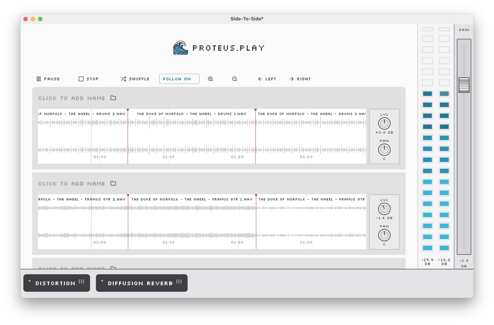

# Proteus Author

Proteus (`.prot`) file authoring application built with **Vue 3**, **TypeScript**, and [**Tauri**](https://tauri.app/). This project is a continuation of the [Multiplay Mixer](https://github.com/howardah/multiplay_mixer) Flutter application.

## Project Status

This project is currently in the early stages of development. Despite being in development for several years at this point as I have not had vast amounts of time to dedicate to it.

## Related Repositories

- [Proteus Player](https://github.com/Proteus-Audio/proteus-player) - Desktop application similar to QuickTime Player for playing single `.prot` files
- [Proteus CLI](https://github.com/Proteus-Audio/proteus-cli) - Rust-based CLI for reading and parsing `.prot` files
- [Multiplay Mixer](https://github.com/howardah/multiplay_mixer) - Outdated Flutter version of this application
- [Multiplay Player](https://github.com/howardah/multiplay) - Outdated Flutter version of Proteus Player

## About

> “It’s possible that our grandchildren will look at us and say ‘You mean people used to listen to the same thing over and over again?’” - Brian Eno

I attended a lecture in 2014 by Dr. Andy Farnell on procedural audio. He spoke, in part, about the distinction between fixed and performance mediums (i.e., film vs. stage, album vs. concert), noting that while a theatre performance has a fixed structure and the story evokes a mood, it also adapts itself to the space and time of the specific performance.

Though, undoubtedly, much of the draw of performance art is owed to community and social connection, I think there’s a case to be made that some of the power of performance is in its subtle unpredictability.

While the world of popular cinematic storytelling is, at least in part, beginning to push itself out of a fixed format ([_Black Mirror: Bandersnatch_](https://www.npr.org/2018/12/28/680671691/black-mirror-bandersnatch-makes-you-choose-your-own-adventure) / [Netflix’s growing library of interactive content](https://help.netflix.com/en/node/62526)) and the world of video gaming, which has long touted interactive storytelling, is [approaching cinematic realism](https://youtu.be/d8B1LNrBpqc), popular recorded music is still very much fixed.

Procedural music itself is not a new thing; the video game and contemporary composition communities have been exploring it for a long while (Steve Reich’s [_It’s Gonna Rain_](https://www.npr.org/sections/deceptivecadence/2015/01/27/381575433/fifty-years-of-steve-reichs-its-gonna-rain) was recorded in 1965). But, as of yet, examples of procedural music in the realm of song are sparse.

The possibly obvious solution that I would like to explore would be to record a song in such a way that you have some number (say 10) of each individual part (i.e., 10 takes of the vocal, 10 of the drums, 10 of the guitar, etc.). Then on playback, you choose a random selection of each part. On a simple song with 5 parts (guitar, vocals, drums, bass, synth), this would yield 100,000 unique combinations.

Widespread internet accessibility and the popularity of streaming music could make this potentially very achievable.

My first proof of concept of this variable playback format ([hosted here](https://multiplay-wnabuuzq2q-uc.a.run.app/?ref=ath)) used [SoX](http://sox.sourceforge.net/) to simply combine the parts of a short piece into a new random composite file. In early 2021, I started to work on expanding the idea with two [Flutter](https://flutter.dev/)-based desktop applications ([here](https://github.com/howardah/multiplay) & [here](https://github.com/howardah/multiplay_mixer)) that read and write [Matroska](https://www.matroska.org/index.html) audio files. Using a streamable container file format like Matroska, it is possible to hold all the parts in one distinct package and stream different sets together, as well as include additional data that can serve as a guide for how to process each part of the recording.

In mid-2022, I decided to replace the Flutter applications with an [ElectronJS](https://www.electronjs.org/) application in order to make use of the flexibility of CSS styling and, at the same time, decided to name the project after the Greek sea-god [Proteus](https://en.wikipedia.org/wiki/Proteus), who represents mutability and is the root of the adjective "protean."

Shortly after beginning to write the Electron application, I realised that the resulting file size and build performance were far from ideal for a relatively simple application. I did some additional research and found [Tauri](https://tauri.app/), which offers nearly everything that I was looking for with Electron but with _significantly_ improved performance. Tauri's performant Rust-based architecture encouraged me to build out a Rust-based core library for parsing and playing `.prot` files, which is integrated into this project as well as the [Proteus Player](https://github.com/Proteus-Audio/proteus-player) application.

There's still much to do with the project, so if you would like to follow along, you can keep tabs on this repo via its [issues page](https://github.com/Proteus-Audio/proteus-author/issues). If you’d like to talk about the idea, feel free to give me a shout at [adam.thomas.howard@gmail.com](mailto:adam.thomas.howard@gmail.com)!

## License

This project is licensed under the [PolyForm Small Business License 1.0.0](https://polyformproject.org/licenses/small-business/1.0.0/).

- ✅ Free for individuals and businesses making less than $1M USD annual revenue.
- 💰 Commercial license required for larger organizations.
- Contact [Adam Howard](mailto:adam.thomas.howard@gmail.com) to obtain a commercial license.
